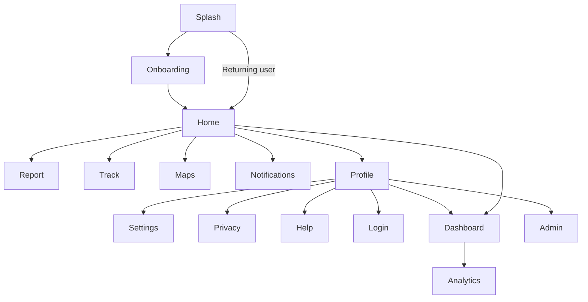

# EcoWatch — Software Architecture

## Overview

EcoWatch is a **backend-agnostic** Flutter application for environmental civic engagement in Tarkwa, Ghana. The architecture follows **Clean Architecture** with **feature-first** organization and **Riverpod** for dependency injection and state management.

```
┌─────────────────────────────────────────────────────────────┐
│                    Presentation Layer                        │
│  features/*/presentation  •  core/widgets  •  routes         │
├─────────────────────────────────────────────────────────────┤
│                    Application Layer                         │
│  providers/  •  ViewModels (Riverpod Notifiers)              │
├─────────────────────────────────────────────────────────────┤
│                      Domain Layer                            │
│  models/  •  repositories/interfaces  •  services/interfaces│
├─────────────────────────────────────────────────────────────┤
│                       Data Layer                             │
│  repositories/implementations  •  mock/  •  local datasources│
│  core/network/api_client                                     │
└─────────────────────────────────────────────────────────────┘
                              │
                    [Future Backend API]
```

## Design Decisions

| Decision | Choice | Rationale |
|----------|--------|-----------|
| State management | **Riverpod** | Compile-safe DI, easy mock swapping, testable |
| Navigation | **go_router** | Declarative routes, deep linking ready |
| Architecture | **Clean + Feature-first** | Scales for final-year → production path |
| Offline storage | **SharedPreferences (JSON)** | Simple start; swap for Hive/SQLite later |
| Maps | **Abstraction + placeholder** | Google Maps added without refactoring |
| AI | **Interface + Mock** | TensorFlow Lite plugs in via `AiPredictionService` |

## Folder Structure

```
lib/
├── main.dart                 # Entry → bootstrap()
├── app.dart                  # MaterialApp + ProviderScope
├── core/
│   ├── constants/            # App-wide constants
│   ├── errors/               # Result<T>, AppException
│   ├── network/              # ApiClient abstraction
│   ├── theme/                # AppTheme
│   └── widgets/              # Shared UI components
├── models/                   # Domain entities (no DB coupling)
├── services/
│   ├── ai/                   # Image classification
│   ├── analytics/            # (via repository)
│   ├── gis/                  # Maps, heatmap, clustering
│   ├── mock/                 # DummyData
│   ├── offline/              # Sync, connectivity, local storage
│   ├── security/             # RBAC, tokens, secure storage
│   ├── severity/             # SeverityEngine
│   └── ussd/                 # USSD flow handler
├── repositories/
│   ├── interfaces/           # Abstract contracts
│   └── implementations/      # Mock + offline-first impls
├── providers/                # Riverpod DI container
├── routes/                   # go_router configuration
└── features/
    ├── splash/
    ├── onboarding/
    ├── auth/
    ├── home/
    ├── report/
    ├── track/
    ├── maps/
    ├── notifications/
    ├── profile/
    ├── settings/
    ├── privacy/
    ├── help/
    ├── dashboard/
    ├── analytics/
    └── admin/
```

## Backend Integration Points

Replace these providers in `providers/dependency_injection.dart`:

1. `apiClientProvider` → Real HTTP client (Dio/http)
2. `reportRemoteDataSourceProvider` → REST implementation
3. `authRepositoryProvider` → JWT/OAuth backend
4. `aiPredictionServiceProvider` → TfliteAiPredictionService (optional cloud fallback)
5. `mapServiceProvider` → Google Maps implementation

## Navigation Flow



## Security Architecture

- **RBAC**: `RbacService` gates UI; backend must mirror roles
- **Anonymous reporting**: Default; no device IDs collected
- **Tokens**: `TokenService` generates EW-XXXX-XXXX; stored in `FlutterSecureStorage`
- **Privacy**: Documented in Privacy screen; Ghana DPA compliant design

## Offline-First Flow

1. Report submitted → saved locally with `SyncStatus.pendingUpload`
2. `ConnectivityService` detects online → `OfflineSyncService.syncPendingReports()`
3. Remote success → `SyncStatus.synced`
4. Failure → remains pending for retry
