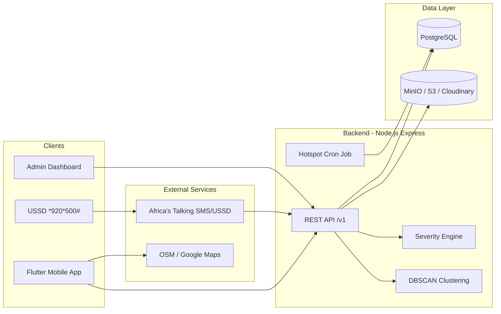

# EcoWatch Tarkwa — Component Architecture

Direct PostgreSQL + REST backend architecture for civic environmental reporting in Tarkwa, Ghana.

## System overview



## Components

### 1. Mobile application (Flutter)

| Capability | Implementation |
|------------|----------------|
| Report incidents | 8 categories, anonymous submit |
| Location | GPS (private), address search, map pin (submitted) |
| Media | Photo/video capture, compress before upload |
| Tracking | `EW-XXXX-XXXX` token, no login |
| Offline | Local drafts + sync queue |

**Location:** `lib/features/report/`

### 2. Backend (Express)

| Module | Path | Responsibility |
|--------|------|----------------|
| Reports | `backend/src/routes/reports.js` | CRUD, media upload, tracking |
| Auth | `backend/src/routes/auth.js` | JWT login (dashboard only) |
| Maps | `backend/src/routes/maps.js` | Hotspots, bbox queries |
| Analytics | `backend/src/routes/analytics.js` | Trends, CSV export |
| USSD | `backend/src/routes/ussd.js` | Africa's Talking webhook |
| Public | `backend/src/routes/public.js` | Emergency contacts, announcements |
| Sync | `backend/src/routes/sync.js` | Offline batch stub |

**Services:**
- `severityService.js` — PRD scoring (+2 image, +3 nearby, +1 recent)
- `hotspotService.js` — DBSCAN clustering (1 km, 5+ reports)
- `tokenService.js` — tracking tokens, phone hashing
- `mediaService.js` — local uploads (MinIO/S3 ready)

### 3. PostgreSQL schema

| Table | Purpose |
|-------|---------|
| `reports` | Incident metadata, GPS, severity, tracking token |
| `report_media` | Photo/video URLs |
| `report_status_history` | Status audit trail |
| `users` / `roles` | Dashboard RBAC |
| `announcements` | Public notices |
| `emergency_contacts` | NADMO, Fire, EPA |
| `hotspots` | Persisted DBSCAN clusters |
| `ussd_sessions` | Hashed phone session log |

Schema: `backend/db/schema.sql`

### 4. External services

| Service | Use |
|---------|-----|
| Africa's Talking | USSD `*920*500#`, SMS alerts |
| MinIO / S3 / Cloudinary | Media object storage |
| OpenStreetMap / Google Maps | Map tiles, geocoding |

### 5. Admin dashboard

Flutter admin shell + REST API:
- JWT + role-based access (`environmental_officer`, `epa_analyst`, `researcher`)
- Real-time reports table
- Map markers + heatmap (hotspot endpoint)
- Analytics + CSV export
- Status updates with history

### 6. Analytics

| Feature | Details |
|---------|---------|
| Heatmap | DBSCAN, eps=1 km, minPts=5 |
| Trends | Daily/weekly/monthly counts |
| Severity | Server-side PRD formula |
| Hotspot alert | 5+ reports within 1 km in 7 days |

Background job: `backend/src/jobs/hotspotJob.js` (every 6 hours)

### 7. Privacy

- No reporter authentication
- No IMEI or IP address storage
- Anonymous tracking tokens only
- USSD phone numbers hashed (SHA-256)
- Device GPS kept local; only map pin coordinates submitted

### 8. Additional features

| Feature | Status |
|---------|--------|
| Emergency call buttons | `GET /v1/public/emergency-contacts` |
| Public announcements | `GET /v1/public/announcements` |
| Environmental education | Flutter resources screen (static) |
| AI classification | Mock on mobile; TFLite planned |

## Deployment topology

```text
┌─────────────┐     HTTPS      ┌──────────────┐
│ Flutter App │ ─────────────► │ Load Balancer│
└─────────────┘                └──────┬───────┘
                                      │
                               ┌──────▼───────┐
                               │ Express API  │
                               └──────┬───────┘
                    ┌─────────────────┼─────────────────┐
                    │                 │                 │
             ┌──────▼──────┐   ┌──────▼──────┐   ┌──────▼──────┐
             │ PostgreSQL  │   │ MinIO / S3  │   │ Africa's    │
             │             │   │             │   │ Talking     │
             └─────────────┘   └─────────────┘   └─────────────┘
```

## Local development

```powershell
cd backend
docker compose up -d
npm install
npm run db:migrate
npm run db:seed
npm run dev
```

Point Flutter `AppConstants.apiBaseUrl` to `http://localhost:3000/v1`.

See also: [backend/README.md](../backend/README.md)
