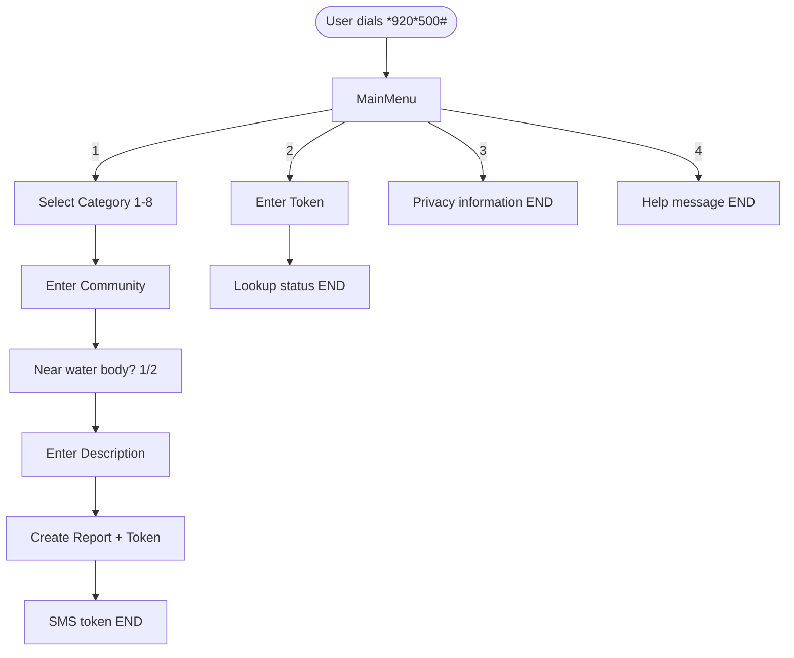

# USSD Module — EcoWatch Tarkwa

## Short Code

`*920*500#` (PRD — configure with Africa's Talking)

## Flow Diagram



## Menu Tree

```
Level 0: Welcome to EcoWatch Tarkwa
         1. Report Incident
         2. Track Report
         3. Privacy Information
         4. Help

Level 1 (Report): Select category
         1. Illegal Mining
         2. Water Pollution
         3. Waste Dumping
         4. Air Pollution
         5. Noise Pollution
         6. Deforestation
         7. Land Degradation
         8. Other

Level 2: Enter community name

Level 3: Near water body?
         1. Yes
         2. No

Level 4: Enter description → Submit → END with token
```

## Request Structure (Africa's Talking)

```json
{
  "sessionId": "ATUid_abc123",
  "phoneNumber": "+233241234567",
  "serviceCode": "*920*500#",
  "text": "1*2*Banso*1*Mining near river",
  "networkCode": "62001"
}
```

| Field | Description |
|-------|-------------|
| sessionId | Unique session identifier from gateway |
| phoneNumber | Caller MSISDN (hashed server-side; never stored raw per privacy policy) |
| serviceCode | USSD short code dialed |
| text | Cumulative user input, `*` separated |
| networkCode | Mobile network operator code |

## Response Format

```
CON <message>   — continue session
END <message>   — terminate session
```

## Privacy (PRD §11)

- Never store IMEI, device IDs, or IP addresses
- Store only tracking token for citizen follow-up
- Phone numbers hashed server-side when backend is connected

## Implementation

Reference handler: `lib/services/ussd/ussd_service.dart` (`MockUssdService`)

Webhook endpoint stub: `ApiEndpoints.ussdWebhook` in `lib/core/network/api_client.dart`
